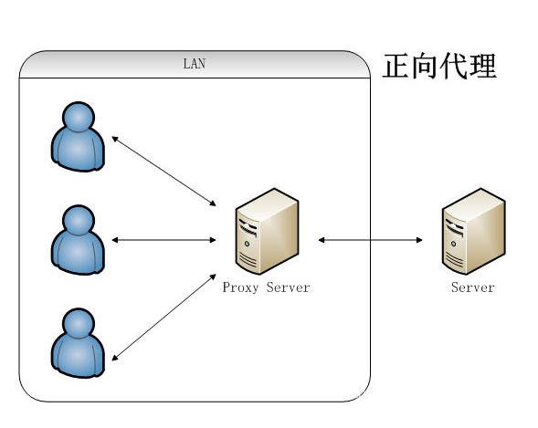

# 代理服务

## 1. 配置

| 类型   | 种类            |
| ------ | --------------- |
| 语法   | proxy_pass URL  |
| 默认   | -               |
| 上下文 | server,location |

## 2. 正向代理

- 正向代理的对象是客户端,服务器端看不到真正的客户端
- 通过公司代理服务器上网

<!--  -->
