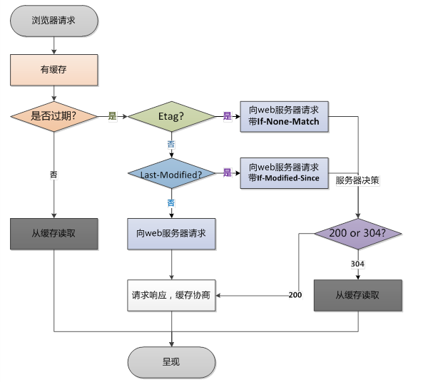

# 静态资源 Web 服务

## 1. 静态和动态资源

- 静态资源：一般客户端发送请求到 web 服务器，web 服务器从内存在取到相应的文件，返回给客户端，客户端解析并渲染显示出来。
- 动态资源：一般客户端请求的动态资源，先将请求交于 web 容器，web 容器连接数据库，数据库处理数据之后，将内容交给 web 服务器，web 服务器返回给客户端解析渲染处理。

| 类型       | 种类           |
| ---------- | -------------- |
| 浏览器渲染 | HTML、CSS、JS  |
| 图片       | JPEG、GIF、PNG |
| 视频       | FLV、MPEG      |
| 下载文件   | Word、Excel    |

## 2. CDN

- CDN 的全称是 Content Delivery Network，即内容分发网络。
- CDN 系统能够实时地根据网络流量和各节点的连接、负载状况以及到用户的距离和响应时间等综合信息将用户的请求重新导向离用户最近的服务节点上。其目的是使用户可就近取得所需内容，解决 Internet 网络拥挤的状况，提高用户访问网站的响应速度。


## 3. 配置语法

### 3.1 sendfile

- 不经过用户内核发送文件

| 类型   | 种类                                |
| ------ | ----------------------------------- |
| 语法   | sendfile on / off                   |
| 默认   | sendfile off;                       |
| 上下文 | http,server,location,if in location |

### 3.2 tcp_nopush

- 在 sendfile 开启的情况下，合并多个数据包，提高网络包的传输效率

| 类型   | 种类                 |
| ------ | -------------------- |
| 语法   | tcp_nopush on / off  |
| 默认   | tcp_nopush off;      |
| 上下文 | http,server,location |

### 3.3 tcp_nodelay

- 在 keepalive 连接下，提高网络包的传输实时性

| 类型   | 种类                 |
| ------ | -------------------- |
| 语法   | tcp_nodelay on / off |
| 默认   | tcp_nodelay on;      |
| 上下文 | http,server,location |

### 3.4 gzip

- 压缩文件可以节约带宽和提高网络传输效率

| 类型   | 种类                 |
| ------ | -------------------- |
| 语法   | gzip on / off        |
| 默认   | gzip off;            |
| 上下文 | http,server,location |

### 3.5 gzip_comp_level

- 压缩比率越高，文件被压缩的体积越小

| 类型   | 种类                  |
| ------ | --------------------- |
| 语法   | gzip_comp_level level |
| 默认   | gzip_comp_level 1;    |
| 上下文 | http,server,location  |

### 3.6 gzip_http_version

- 压缩版本

| 类型   | 种类                      |
| ------ | ------------------------- |
| 语法   | gzip_http_version 1.0/1.1 |
| 默认   | gzip_http_version 1.1;    |
| 上下文 | http,server,location      |

### 3.7 http_gzip-static_module

- 先找磁盘上找同名的.gz 这个文件是否存在,节约 CPU 的压缩时间和性能损耗
- http_gzip_static_module 预计 gzip 模块
- http_gunzip_module 应用支持 gunzip 的压缩方式

| 类型   | 种类                 |
| ------ | -------------------- |
| 语法   | gzip_static on/off   |
| 默认   | gzip_static off;     |
| 上下文 | http,server,location |

### 3.8 例

```bash
echo color > color.html
gzip color.html
```

/etc/nginx/conf.d/default.conf

```bash
mkdir -p /data/www/images
mkdir -p /data/www/html
echo color > /data/www/html/color.html
gzip /data/www/html/color.html
mkdir -p /data/www/js
mkdir -p /data/www/css
mkdir -p /data/www/download
```

```bash
location ~ .*\.(jpg|png|gif)$ {
  gzip off;#关闭压缩
  root /data/www/images;
}

location ~ .*\.(html|js|css)$ {
  gzip_static on;
  gzip on; #启用压缩
  gzip_min_length 1k;    #只压缩超过1K的文件
  gzip_http_version 1.1; #启用gzip压缩所需的HTTP最低版本
  gzip_comp_level 9;     #压缩级别，压缩比率越高文件被压缩的体积越小
  gzip_types  text/css application/javascript;#进行压缩的文件类型
  root /data/www/html;
}

location ~ ^/download {
  gzip_static on; #启用压缩
  tcp_nopush on;  # 不要着急发，攒一波再发
  root /data/www; # 注意此处目录是`/data/www`而不是`/data/www/download`
}
```

## 4. 浏览器缓存

- 校验本地缓存是否过期



| 类型          | 种类                            |
| ------------- | ------------------------------- |
| 检验是否过期  | Expires、Cache-Control(max-age) |
| Etag          | Etag                            |
| Last-Modified | Last-Modified                   |

### 4.1 expires

- 添加 Cache-Control、Expires 头

| 类型   | 种类                 |
| ------ | -------------------- |
| 语法   | expires time         |
| 默认   | expires off;         |
| 上下文 | http,server,location |

```bash
location ~ .*\.(jpg|png|gif)$ {
  expires 24h;
}
```
